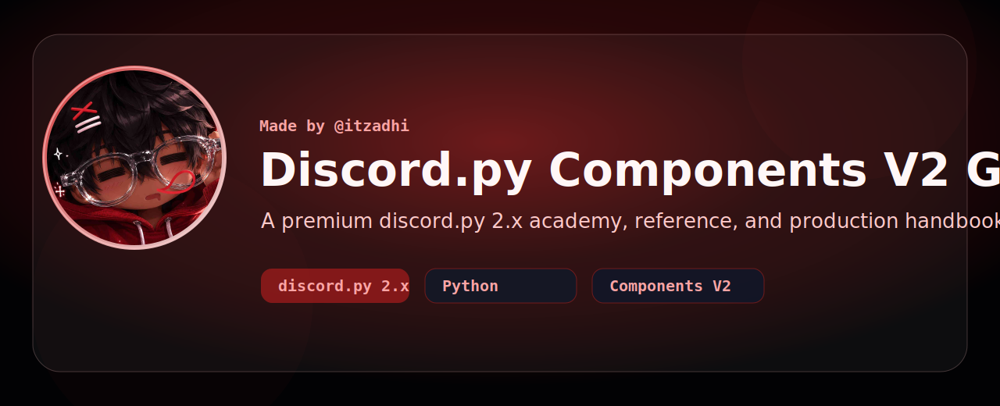
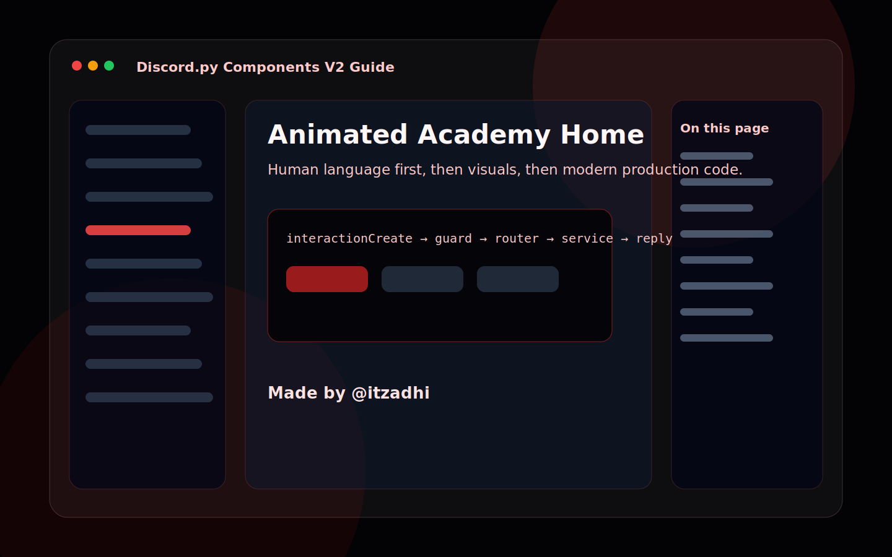
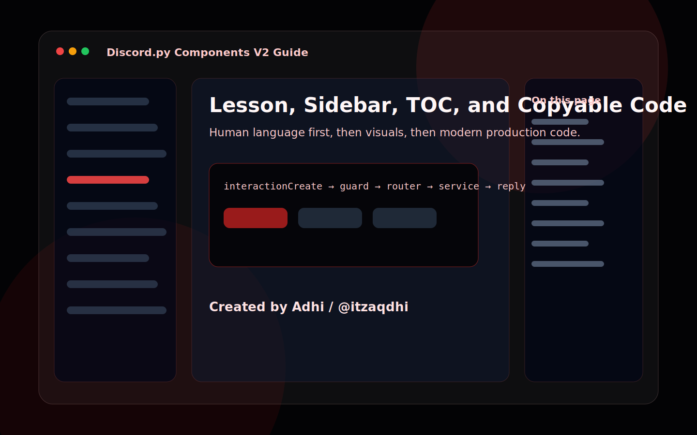
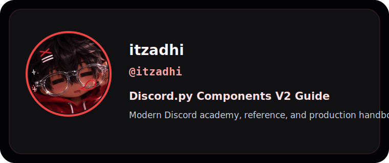

# Discord.py Components V2 Guide

[](https://github.com/itzadhi/discordpy-components-v2-guide/actions/workflows/ci.yml)
[](https://github.com/itzadhi/discordpy-components-v2-guide/actions/workflows/pages.yml)
[](./LICENSE)
[](https://github.com/itzadhi)

**A premium discord.py 2.x academy, reference, and production handbook for modern interactions.**

This repository is built to feel like an official framework documentation site, a premium paid course, a production engineering handbook, an advanced developer wiki, and a beginner academy at the same time.

Made by **@itzadhi**.

## Preview





## What Makes It Different

- Human-language explanations before code.
- Modern Discord API practices only for **discord.py 2.x**.
- Components-first teaching with buttons, selects, modals, routing, persistence, security, and scale.
- Searchable Next.js documentation with MDX lessons, sidebar navigation, table of contents, copy buttons, syntax highlighting, animated hero, responsive layout, and shadcn-style UI.
- Production architecture guidance for handlers, services, managers, database layers, loaders, validation, rate limits, logging, hosting, and scaling.
- Outdated method warnings that explain why old patterns are risky and how to migrate.
- Verified example source in `examples/discordpy-bot`.

## Quick Start

```bash
npm install
npm run verify
npm run dev
```

Open the documentation locally at [http://localhost:3000](http://localhost:3000).

Production documentation is configured for GitHub Pages: [https://itzadhi.github.io/discordpy-components-v2-guide/](https://itzadhi.github.io/discordpy-components-v2-guide/)

## Documentation Map

- Introduction, setup, and project structures
- Slash/app commands, permissions, localization, deployment, and autocomplete
- Components V2, buttons, select menus, modals, persistent UI, and routing
- Events, databases, production systems, security, hosting, and scaling
- Full real projects with source modules and architecture notes
- FAQ, troubleshooting, glossary, comparison pages, quick references, and function-by-function API explanations

## Example Verification

Python examples are checked with `python -m py_compile` through `scripts/validate_examples.py`.

## Branding

The provided logo is used in the README banner, documentation navbar, homepage splash, footer, favicon metadata, social preview card, GitHub profile card asset, and generated preview artwork.




## Contributing

Read [CONTRIBUTING.md](./CONTRIBUTING.md), [SECURITY.md](./SECURITY.md), and [CODE_OF_CONDUCT.md](./CODE_OF_CONDUCT.md). Contributions should preserve the required lesson structure and avoid deprecated Discord patterns.

## Primary References

- [Discord Components Overview](https://docs.discord.com/developers/components/overview)
- [Discord Component Reference](https://docs.discord.com/developers/components/reference)
- [discord.py interactions API](https://discordpy.readthedocs.io/en/stable/interactions/api.html)

## License

MIT License. See [LICENSE](./LICENSE).
