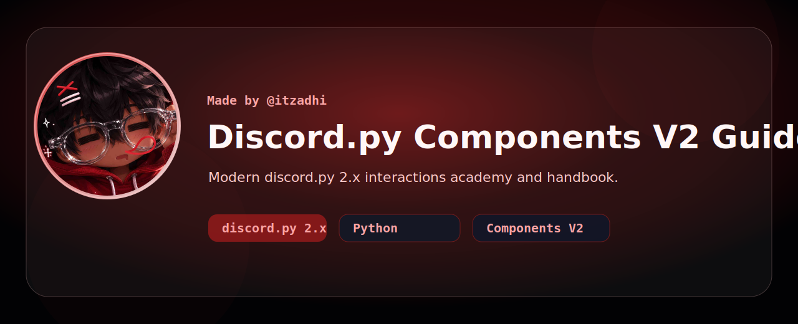
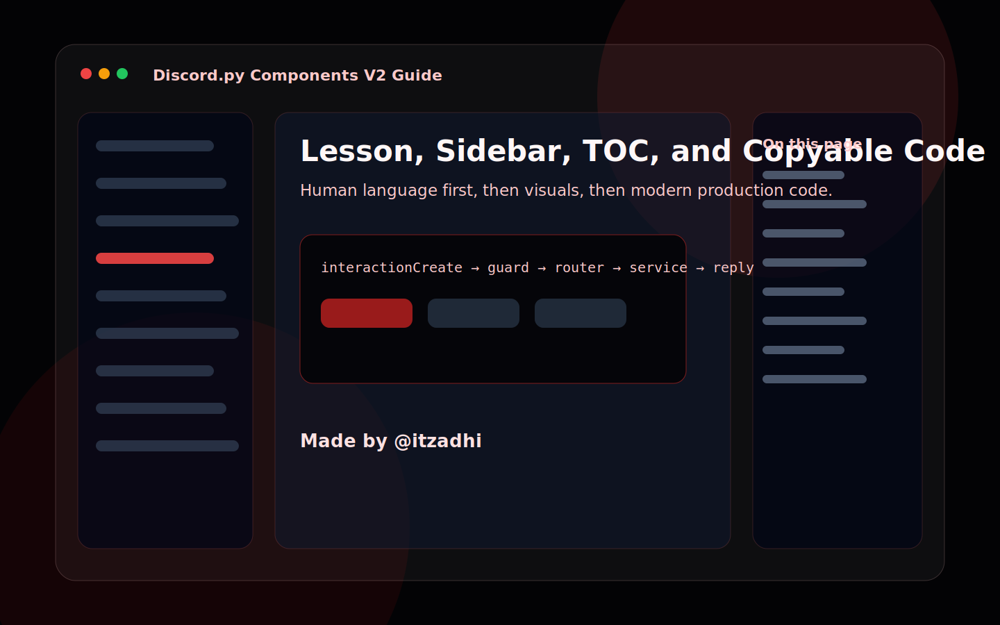

<p align="center">
  
</p>

<h1 align="center">Discord.py Components V2 Guide</h1>

<p align="center">
  <strong>Modern discord.py 2.x interactions academy, reference, and production handbook.</strong>
</p>

<p align="center">
  <strong>Made by <a href="https://github.com/itzadhi">@itzadhi</a></strong>
</p>

<p align="center">
  <a href="https://github.com/itzadhi/discordpy-components-v2-guide/actions/workflows/ci.yml"></a>
  <a href="https://github.com/itzadhi/discordpy-components-v2-guide/actions/workflows/pages.yml"></a>
  <a href="./LICENSE"></a>
  <a href="https://github.com/itzadhi"></a>
</p>

## Why This Exists

This repository is designed as a beginner academy, modern discord.py reference, and production architecture handbook in one place. Lessons explain the human idea first, then the Discord API behavior, then beginner code, scalable code, production code, mistakes, security, performance, and challenges.

Every example uses modern Discord API practices for **discord.py 2.x**. Deprecated interaction handling, old command styles, and pre-2.x patterns are marked as outdated when they appear for migration context.

## Preview

<table>
  <tr>
    <td width="50%"></td>
    <td width="50%"></td>
  </tr>
</table>

## What Makes It Different

- Human-language explanations before code.
- Components-first teaching for views, buttons, selects, modals, persistence, security, and scale.
- Function-by-function documentation that explains what each discord.py class, callback, decorator, method, and handler does.
- Searchable Next.js documentation with MDX lessons, sidebar navigation, table of contents, copy buttons, syntax highlighting, animated hero, responsive layout, and shadcn-style UI.
- Production architecture guidance for Cogs, services, managers, database layers, loaders, validation, rate limits, logging, hosting, and scaling.
- Outdated method warnings that explain why old patterns are risky and how to migrate.
- Verified example source in `examples/discordpy-bot`.

## Quick Start

```bash
npm install
npm run verify
npm run dev
```

Open the documentation locally at [http://localhost:3000](http://localhost:3000).

Production documentation is configured for GitHub Pages: [https://itzadhi.github.io/discordpy-components-v2-guide/](https://itzadhi.github.io/discordpy-components-v2-guide/)

## Documentation Map

- Introduction, setup, and project structures
- Slash/app commands, permissions, localization, deployment, and autocomplete
- Components V2, buttons, select menus, modals, persistent UI, and routing
- Events, databases, production systems, security, hosting, and scaling
- Full real projects with source modules and architecture notes
- FAQ, troubleshooting, glossary, comparison pages, quick references, and function-by-function API explanations

## Example Verification

Python examples are checked with `python -m py_compile` through `scripts/validate_examples.py`.

## Branding

The provided logo is used in the README banner, documentation navbar, homepage splash, footer, favicon metadata, social preview card, GitHub profile card asset, and generated preview artwork.

<p align="center">
  
</p>

## Contributing

Read [CONTRIBUTING.md](./CONTRIBUTING.md), [SECURITY.md](./SECURITY.md), and [CODE_OF_CONDUCT.md](./CODE_OF_CONDUCT.md). Contributions should preserve the required lesson structure and avoid deprecated Discord patterns.

## Primary References

- [Discord Components Overview](https://docs.discord.com/developers/components/overview)
- [Discord Component Reference](https://docs.discord.com/developers/components/reference)
- [discord.py interactions API](https://discordpy.readthedocs.io/en/stable/interactions/api.html)

## License

MIT License. See [LICENSE](./LICENSE).
